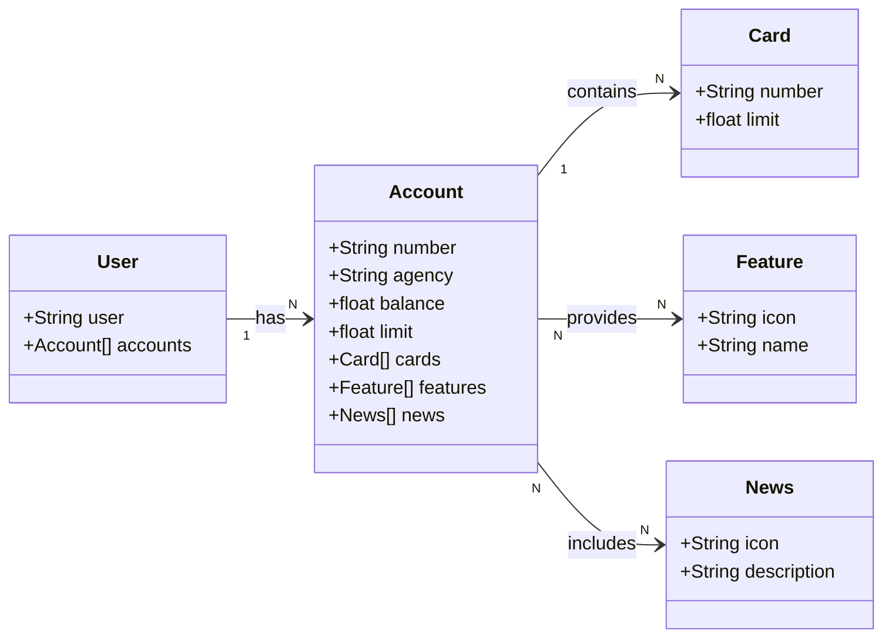

## Diagrama de Classes

```mermaid
classDiagram
    direction LR
    class User {
        +String user
        +Account[] accounts
    }
    
    class Account {
        +String number
        +String agency
        +float balance
        +float limit
        +Card[] cards
        +Feature[] features
        +News[] news
    }
    
    class Card {
        +String number
        +float limit
    }
    
    class Feature {
        +String icon
        +String name
    }
    
    class News {
        +String icon
        +String description
    }
    
    User "1" --> "N" Account : has
    Account "1" --> "N" Card : contains
    Account "N" --> "N" Feature : provides
    Account "N" --> "N" News : includes

```
